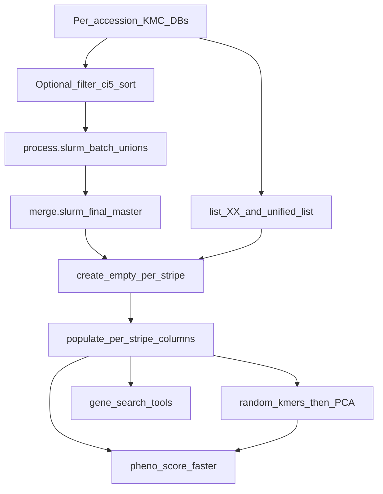

# kmer_search — system reference

This document is the behavioural north-star for the refactor. Prefer it over local comments or README snippets when deciding what the toolkit is supposed to do. It describes **what** the supported tools do and **how the production pipeline wires them together**, not how to redesign them.

Evidence for the operational pipeline lives in [`matrix_presetup/`](matrix_presetup/) (Slurm scripts, KMC templates, list files). Source under review: [`kmer_search/`](kmer_search/) (left unchanged while this document guides work).

---

## Purpose

**kmer_search** is a k-mer presence/absence (PA) GWAS toolkit. It:

1. Builds a compact binary **presence/absence matrix** of DNA k-mers across many accessions, from per-accession [KMC](https://github.com/refresh-bio/KMC) databases.
2. Scores every k-mer against phenotypes while adjusting for population structure (PCA covariates).
3. Looks up PA patterns for k-mers taken from a gene of interest (follow-up after association).

Typical biological setting: multi-accession panels (e.g. Watkins wheat tetraploids / wheat blast phenotypes) with large k-mer inventories (often k = 31).

---

## Supported scope

Only four binaries are part of the supported product. Everything else in the makefile is legacy and **out of scope** for behaviour we preserve.

| Binary | Role |
|---|---|
| `kmer_pa_matrix_new` | Create and fill PA stripe files |
| `kmer_pa_matrix_pa_pheno_score_faster` | Genome-wide k-mer ↔ phenotype association |
| `kmer_pa_matrix_gene_search_multi` | Gene follow-up via linear scan of PA stripes |
| `kmat_gene_search` | Gene follow-up via indexed random access |

**Legacy / not part of the supported pipeline** (examples): `kmer_search`, `kmer_pa_matrix`, `kmer_pa_matrix_search`, `kmer_pa_matrix_gene_search`, `kmer_pa_matrix_dump`, older phenotype scorers, grammar score, `kmer_pa_matrix_pa_pheno_random`, etc. They may remain in the tree until removal; they are not reference behaviour.

**Operational recipe (not binaries):** [`matrix_presetup/`](matrix_presetup/) documents how KMC DBs, list files, blank PA stripes, fills, and PCA covariates are produced in production. A related R helper also exists as [`kmer_search/GWAS_create_PCA.R`](kmer_search/GWAS_create_PCA.R); the Watkins4x copy used in practice is [`matrix_presetup/GWAS_create_PCA.R`](matrix_presetup/GWAS_create_PCA.R).

---

## End-to-end pipeline



1. **Per-accession KMC DBs:** Each accession has a KMC database (often under a `reduced_kmers/` tree). Raw `kmc` counting of sequencing reads is **upstream of `matrix_presetup/`** and is not scripted in that folder.
2. **Optional filter:** Reduce noise with `kmc_tools transform … -ci5 sort` (keep k-mers with count ≥ 5).
3. **Master union:** Hierarchical `kmc_tools complex` unions → intermediate batch results → single master DB named **`final`** (the PA row universe).
4. **List files:** Partition accessions into stripe groups of ≤64 (`list_XX.txt`); concatenate into `unified_list.txt`.
5. **Blank PA:** For each stripe, run `kmer_pa_matrix_new --create-pa` with `-m final` and that stripe’s `-k list_XX.txt`.
6. **Fill PA:** For each stripe, for each local accession index `-n`, run `kmer_pa_matrix_new` to set presence bits.
7. **PCA covariates:** Sample random k-mer PA patterns; run R PCA; emit a population-structure TSV.
8. **GWAS:** `kmer_pa_matrix_pa_pheno_score_faster` over `matrix_list.txt` + phenotypes + PCA.
9. **Gene follow-up (optional):** `kmat_gene_search` or `kmer_pa_matrix_gene_search_multi` against the same stripes.

GWAS and gene search are independent consumers of the filled PA stripes. Gene search does not require GWAS; GWAS does not require gene search.

---

## Upstream KMC preparation

Evidence: [`matrix_presetup/`](matrix_presetup/). Watkins4x paths below are the concrete production example (351 accessions).

| Stage | Evidence | What happens |
|---|---|---|
| Per-accession KMC DBs | Paths in [`kmc_template_4x.txt`](matrix_presetup/kmc_template_4x.txt), [`list_*.txt`](matrix_presetup/list_00.txt) | One KMC DB per accession, e.g. `.../reduced_kmers/ACCESSION/ACCESSION` (reference genomes may live under `.../kmers/`). Raw read→KMC count is outside this folder. |
| Filter / reduce | [`filter.slurm`](matrix_presetup/filter.slurm) | `kmc_tools transform <db> -ci5 sort <out>` — keep k-mers with count ≥ 5. The checked-in script uses a different panel path; Watkins4x already points at `reduced_kmers/`. |
| Hierarchical union | [`process.slurm`](matrix_presetup/process.slurm) + [`kmc_template_4x.txt`](matrix_presetup/kmc_template_4x.txt) | `kmc_tools complex`: INPUT sets = accession DBs; OUTPUT batches of ~20 accessions → intermediate `resultN`. |
| Master merge | [`merge.slurm`](matrix_presetup/merge.slurm) + [`merge_template_4x.txt`](matrix_presetup/merge_template_4x.txt) | Union all intermediates → **`final`**. This is the `-m` / `--master-database` argument for PA create and fill. |
| Optional histogram | [`histo.slurm`](matrix_presetup/histo.slurm) | `kmc_tools transform final histogram kmc_hist.txt` |

The master DB is a **set-union of k-mer presence** across accessions (KMC `+` complex operations). It defines which rows exist in every PA stripe. Counters in the master are not the PA matrix; presence in each accession is resolved later by querying that accession’s own KMC DB during fill.

---

## File organisation and list conventions

Production does **not** build one wide multi-word PA file and then split it. Accessions are partitioned into stripe groups of ≤64 **before** create/fill. Each stripe is its own PA file sharing the same master row order.

### Watkins4x example (351 accessions → 6 stripes)

| File | Role |
|---|---|
| [`list_00.txt`](matrix_presetup/list_00.txt) … [`list_05.txt`](matrix_presetup/list_05.txt) | Full KMC DB paths for one stripe (`00`–`04`: 64 lines; `05`: 31 lines) |
| [`unified_list.txt`](matrix_presetup/unified_list.txt) | Global accession order = concatenation of `list_00`…`list_05` (351 lines) |
| [`modified_list.txt`](matrix_presetup/modified_list.txt) | Accession IDs only (basename of each path), same order — used by the PCA R script |
| [`matrix_list.txt`](matrix_presetup/matrix_list.txt) | Paths to filled stripe bins in stripe order (`watkins_4x.dev.00.bin` … `.05.bin` in the checked-in example) |
| `final` | Master/union KMC DB (`-m`) |
| `watkins_4x.XX.bin` | One PA stripe for the accessions in `list_XX.txt` |

### Column indexing

- **Global** column index `g` = position in `unified_list.txt` (0-based).
- **Stripe** = `g // 64`; **local bit** within that stripe’s word = `g % 64`.
- Create/fill jobs never pass a global index. They receive only that stripe’s `-k list_XX.txt` and a **local** `-n` (0 … length(list_XX)−1).

Downstream tools that take `-k unified_list.txt` and `-i matrix_list.txt` reassemble the full presence vector by reading stripe files in list order and packing bits across words.

---

## Shared vocabulary

### Accession

A sample/genotype. Global column order is fixed by `unified_list.txt` (full KMC paths, one per line). Stripe-local order is fixed by the corresponding `list_XX.txt`.

### K-mer

A DNA word of length `k` (CLI `-s` / `--kmer-size` where required). Encoded as a `uint64` with **LSB-first 2-bit** packing:

| Base | Bits |
|---|---|
| A | 00 |
| C | 01 |
| G | 10 |
| T | 11 |

Encode/decode logic is duplicated in each binary today (there is **no shared library**).

### Master / union KMC database

Named **`final`** in the Watkins4x merge step. Defines the PA **row universe**. Consumed by `kmer_pa_matrix_new` via `-m` / `--master-database`.

### Presence/absence (PA) matrix

- **Rows:** master k-mers (encoded `uint64`), same order in every stripe.
- **Columns:** accessions (one bit each; 1 = present in that accession’s KMC DB).
- Bits are packed into `uint64` words (up to 64 accessions per word / per stripe).

### Stripe file layout (production)

Each production stripe is created with a `-k` list of ≤64 accessions, so each row is **16 bytes**:

```text
{ uint64 kmer_code, uint64 word }
```

- Stripe `i` holds the bit-word for the accessions in `list_XX` (global indices `[64*i .. 64*i+63]`, truncated on the last stripe).
- The same `kmer_code` appears at the same row index in every stripe; stripes must stay row-aligned (same record count and order).
- `kmat_gene_search` validates that the number of stripe files matches `ceil(N/64)` for N accessions in the accession list, and that stripe sizes match.

`kmer_pa_matrix_new` can also write a **wide** single file when `-k` lists more than 64 accessions (`kmer_code` + `ceil(N/64)` words per row). That shape appears in simple tests such as [`blank.slurm`](matrix_presetup/blank.slurm). Production Watkins4x does **not** use that path: it creates one ≤64-accession stripe file per `list_XX` so GWAS/gene tools can consume the files directly via `matrix_list.txt`.

### Phenotypes

TSV / tabular file (`-p` / `--phenotype-file` on the GWAS tool). Accession names must match the accession list. Multiple phenotype columns are supported; association is run per phenotype.

### Population structure

PCA scores per accession (`-pop` / `--population-structure-file`). The GWAS tool uses an intercept plus the **first two** PC scores as covariates.

---

## Blank PA create and fill

Evidence: [`create_empty.0.slurm`](matrix_presetup/create_empty.0.slurm), [`populate.slurm`](matrix_presetup/populate.slurm), [`populate_dev.slurm`](matrix_presetup/populate_dev.slurm).

### Create empty stripes

Array over stripes `00`…`05` (one job per `list_XX`):

```bash
kmer_pa_matrix_new -m /path/to/final -k /path/to/list_XX.txt -o watkins_4x.XX.bin --create-pa
```

- Lists all k-mers from master `final`.
- Writes one row per master k-mer with a **zeroed** presence word (because that stripe’s list has ≤64 accessions → one `uint64` word).
- Production jobs typically stage I/O on local SSD, then copy the `.bin` back to shared storage.

### Populate (fill) columns

Per stripe, for each local accession index in that stripe’s list:

```bash
kmer_pa_matrix_new -m /path/to/final -k /path/to/list_XX.txt -n LOCAL_INDEX -o watkins_4x.XX.bin
```

- Opens accession `list_XX[LOCAL_INDEX]` for KMC random-access query.
- For each master k-mer / matrix row, sets the corresponding bit in that stripe’s word if the k-mer is present.
- Uses lock files (`.lock.<word_index>`) so concurrent fills that touch the same word are serialised. Independent stripes can run in parallel; within a stripe, fills for different `-n` may be sequential (as in the Slurm loops) or lock-protected if overlapped.

After all stripes are filled, [`matrix_list.txt`](matrix_presetup/matrix_list.txt) points at the stripe bins in order for GWAS and gene search.

### Scale constraints carried into kmat

These production properties are **non-negotiable** for multi-TB / multi-node panels. kmat may replace KMC listing/RA with sorted `.kset` / `.kuniv`, and may compress dense stripes to v2, but must keep this job shape:

| Constraint | Legacy practice | Required for kmat |
|---|---|---|
| File count | O(N/64) large stripe `.bin` files (+ 1 master) | Same order of magnitude; **never** N×hash tiny spills |
| Parallelism | Slurm **array over stripes** (and batch unions for master) | Multi-node create/fill; tree-merge array for master |
| Memory | Fill ≈ `100000 × record_bytes` I/O window | Bounded batches; no U×N in RAM |
| Scratch | Local SSD stage, then `mv` to shared NFS | Prefer `$SLURM_TMPDIR` / localscratch for rewrite traffic |
| Locks | `.lock.<word_index>` if concurrent fills hit one stripe | Preserve when overlapping writers |

**Anti-patterns:** per-accession×partition inode storms; single-node-only build for production panels; permanent duplicate patterns across shards.

---

## PCA preparation before GWAS

Evidence: [`05_random_kmers.slurm`](matrix_presetup/05_random_kmers.slurm), [`06_pca.slurm`](matrix_presetup/06_pca.slurm), [`GWAS_create_PCA.R`](matrix_presetup/GWAS_create_PCA.R), output example [`watkins4x_PCA_full.tsv`](matrix_presetup/watkins4x_PCA_full.tsv).

1. Export / sample random k-mer PA patterns from the filled matrix (historical job used a legacy random-kmer binary against `unified_list.txt` + `matrix_list.txt`).
2. Build a columns×accessions table (e.g. `random_kmers_cols.tsv`).
3. R `princomp` on that matrix; bind PC loadings to [`modified_list.txt`](matrix_presetup/modified_list.txt); write a PCA TSV (e.g. `watkins4x_PCA_full.tsv`).
4. GWAS consumes that file as `-pop` and uses **PC1 and PC2** (+ intercept) as covariates.

---

## Binaries

### 1. `kmer_pa_matrix_new`

- **Source:** [`kmer_search/kmer_pa_matrix_new.cpp`](kmer_search/kmer_pa_matrix_new.cpp)
- **Role:** Create blank PA stripes and fill accession columns.
- **Production recipe:** [`create_empty.0.slurm`](matrix_presetup/create_empty.0.slurm), [`populate.slurm`](matrix_presetup/populate.slurm)

**Inputs**

| Flag | Meaning |
|---|---|
| `-k` / `--kmer-databases` | File listing per-accession KMC DB paths (**stripe-local** `list_XX.txt` in production) |
| `-m` / `--master-database` | Master/union KMC DB (`final`) |
| `-o` / `--output-file` | PA stripe (or wide-file) output path |
| `-n` / `--specific-kmer` | 0-based **local** accession index within `-k` to fill |
| `--create-pa` (`-pa`) | Initialise a blank PA file |

**Behaviour**

- **`--create-pa`:** List all k-mers from the master KMC DB; write one row per k-mer with zeroed presence bits. Number of words per row = `ceil(length(-k) / 64)`. With a production stripe list (≤64 accessions) this is one word → 16-byte records.
- **Fill mode (`-n i`):** For accession `i` in the provided `-k` list, RA-query that accession’s KMC DB; set the bit for present k-mers. Lock files keyed by word index allow safe concurrent writers.

**Outputs:** Binary PA file at `-o` (one stripe per production job).

Production examples:

```bash
kmer_pa_matrix_new -m .../final -k .../list_00.txt -o watkins_4x.00.bin --create-pa
kmer_pa_matrix_new -m .../final -k .../list_00.txt -n 7 -o watkins_4x.00.bin
```

---

### 2. `kmer_pa_matrix_pa_pheno_score_faster`

- **Source:** [`kmer_search/kmer_pa_matrix_pa_pheno_score_faster.cpp`](kmer_search/kmer_pa_matrix_pa_pheno_score_faster.cpp)
- **Role:** Genome-wide k-mer ↔ phenotype association over filled stripes.

**Inputs**

| Flag | Meaning |
|---|---|
| `-k` / `--kmer-databases` | Global accession list ([`unified_list.txt`](matrix_presetup/unified_list.txt)) |
| `-p` / `--phenotype-file` | Phenotype table |
| `-i` / `--input-matrix-file` | List of PA stripe files ([`matrix_list.txt`](matrix_presetup/matrix_list.txt)) |
| `-pop` / `--population-structure-file` | PCA TSV (e.g. [`watkins4x_PCA_full.tsv`](matrix_presetup/watkins4x_PCA_full.tsv)) |
| `-s` / `--kmer-size` | k (must match database) |
| `-t` / `--threads` | Worker threads |
| `-b` / `--blocks` | I/O block multiplier (blocks of ~8MB-scale reads per stripe) |
| `-N` / `--top-n` | Keep at most this many k-mers by smallest min p-value (default large) |
| `-a` / `--print-all` | Print every scored k-mer instead of top-N |
| `-d` / `--display` | Also print PA bit patterns |

**Behaviour**

- Streams stripe files in blocks; reconstructs each k-mer’s full presence vector `z` across `unified_list` order.
- Residualizes `z` and phenotypes against covariates `[1, PC1, PC2]` (Frisch–Waugh–Lovell / Householder QR).
- Fits OLS association per phenotype; two-sided Student’s t p-values with `df = N − 4` (intercept + 2 PCs + k-mer).
- Emits top hits by minimum p-value across phenotypes (or all rows if `--print-all`).

**Outputs (stdout TSV-style):** decoded k-mer, phenotype carrier sums, number of carriers, per-phenotype p-values; optionally PA bits.

---

### 3. `kmer_pa_matrix_gene_search_multi`

- **Source:** [`kmer_search/kmer_pa_matrix_gene_search_multi.cpp`](kmer_search/kmer_pa_matrix_gene_search_multi.cpp)
- **Role:** Gene follow-up by linear scan of the same stripe set.

**Inputs**

| Flag | Meaning |
|---|---|
| `-p` / `--pa-databases` | List of PA stripe files (`matrix_list.txt`) |
| `-k` / `--kmer-list` | Global accession order (`unified_list.txt`) |
| `-s` / `--kmer-size` | k |
| `-g` / `--gene-of-interest` | Gene FASTA |

**Behaviour**

- Sliding-window k-mers from the gene sequence, plus reverse complements.
- Sequentially scans all stripe files; when a matrix k-mer matches the gene set, prints the decoded k-mer and concatenated PA bitstring across accessions.

**Outputs (stdout):** `kmer` + presence/absence bitstring.

---

### 4. `kmat_gene_search`

- **Source:** [`kmer_search/kmat_gene_search.cpp`](kmer_search/kmat_gene_search.cpp)
- **Role:** Gene follow-up by indexed lookup (preferred for repeated queries).

**Inputs:** Same as `_multi`, plus:

| Flag | Meaning |
|---|---|
| `-x` / `--index` | Index path (default: `<matrix_list>.idx`) |
| `-r` / `--rebuild-index` | Force rebuild even if index exists |

**Behaviour**

- Builds or loads a sorted index `(kmer_code → row_index)` from stripe 0.
- Binary-searches the index for each gene k-mer (fwd + RC).
- Seeks all stripes at that row, sanity-checks k-mer codes stay in sync, prints PA bits in accession order (LSB-first across stripe words).

**Outputs (stdout):** Same idea as `_multi`: k-mer and PA bits across accessions.

---

## Dependencies (as used today)

| Dependency | Used for |
|---|---|
| KMC (`libkmc_core.a` / `kmc_tools`) | Build and query k-mer databases; PA create/fill reads DBs via the KMC API |
| SeqAn2 | CLI parsing, FASTA I/O |
| Eigen | Linear algebra in GWAS |
| Boost | `dynamic_bitset`, Student’s t |
| pthread | GWAS threading |
| R (`princomp`) | PCA covariate file for `-pop` |

Build entrypoint today: [`kmer_search/makefile`](kmer_search/makefile). Compile notes live in [`kmer_search/README.md`](kmer_search/README.md); this architecture doc is not a build or Slurm how-to, but **pipeline semantics from `matrix_presetup/` are in scope**.

---

## Implementation constraint for the refactor

There is **no shared internal library**. Encode/decode, list-file reading, and PA I/O are copy-pasted across binaries. Behavioural equivalence across tools (especially k-mer encoding, stripe layout, and `unified_list` / `matrix_list` ordering) must be preserved when consolidating code.

---

## Non-goals of this document

This file is **not**:

- A build or install guide
- A line-by-line Slurm / cluster operations manual
- An API or directory-layout proposal for the refactor
- A deletion checklist for unused binaries
- A statistical methods paper (GWAS details above are only as implemented)

When behaviour here conflicts with opportunistic comments in old tools, **this document wins** for the four supported binaries and the production pipeline they sit in—and should be updated deliberately if real pipeline behaviour changes.
