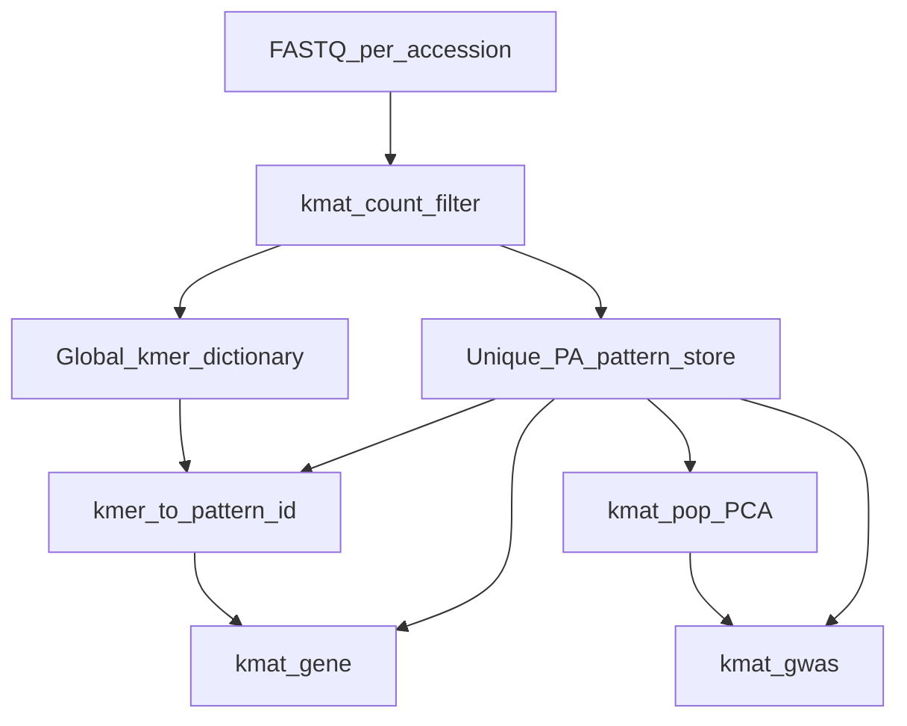

# kmat — refactor roadmap

This is the working plan for rebuilding the toolkit as **kmat**. It covers organisation, phased delivery, performance, testing, and the feature backlog.

| Document | Role |
|---|---|
| [`ARCHITECTURE.md`](ARCHITECTURE.md) | Reference for **today’s** pipeline and scientific intent (build matrix → associate → gene lookup) |
| [`REFACTOR.md`](REFACTOR.md) (this file) | **Target** design: how we rebuild, in what order, and why—including better approaches where scale demands it |
| [`kmat/docs/FORMAT.md`](kmat/docs/FORMAT.md) | On-disk matrix format (v1 dense rows; v2 pattern-compressed) + `.kset` |
| [`kmat/docs/BENCH.md`](kmat/docs/BENCH.md) | Runtime profiles and benchmark baselines (Phase 4) |

No code under [`kmer_search/`](kmer_search/) is required to change while this roadmap is being refined. Implementation lives in the greenfield [`kmat/`](kmat/) tree.

**Parity** means correct scientific outcomes on fixtures (presence bits, comparable GWAS rankings / p-values within tolerance)—not cloning legacy stripe layouts, Slurm scripts, SeqAn CLIs, or R glue forever.

---

## Progress tracker

| Phase | Status | Notes |
|---|---|---|
| **0 — Skeleton** | **done** | CMake, CLI11, lib encode/decode, tests, no SeqAn |
| **1 — Core MVP** | **done** | `build`/`pop`/`gwas`/`gene`/`validate`; tiny FASTA + medium k=31/N=72 FASTQ.gz; multi-stripe; 16 ctests green |
| **2 — Format v2 (patterns)** | **done** | Pattern store + k-mer map; GWAS-by-pattern; [`kmat/docs/FORMAT.md`](kmat/docs/FORMAT.md); 17 ctests green |
| **3 — FASTQ count/filter** | **done** | `.kset` + build-from-kset; production count now **KMC CLI** (`--engine kmc`); builtin fallback for tests |
| **4 — Performance** | **done** | laptop/hpc profiles; parallel GWAS; rolling encode; `kmat_bench` + [`kmat/docs/BENCH.md`](kmat/docs/BENCH.md) |
| **4b — Memory-bounded build** | **done** | streaming `.kset` merge + hash shards under `--memory-gb`; [`kmat/docs/BUILD.md`](kmat/docs/BUILD.md) |
| **5 — UX / features** | pending | config, doctor, polish |

Update this table when a phase’s “done when” criteria are met.

---

## Vision

**kmat** is a maintainable, fast, user-friendly k-mer presence/absence GWAS toolkit that:

1. Ingests data from **raw FASTQ** (no KMC runtime dependency in the steady state).
2. Builds a **pattern-compressed** PA matrix that scales to thousands of accessions and multi-TB datasets.
3. Runs well on a **Mac or Linux laptop** and on **Linux HPC** (NFS-backed storage, large panels, ~150TB-class projects).
4. Exposes one **`kmat <subcommand>`** CLI over a shared library—not a pile of copy-pasted binaries.
5. Produces **population-structure covariates in-house** (`kmat pop`)—no required R step.
6. Ships with **synthetic test data**, unit tests, and validation checks from day one.

### Goals

- Easier to read, test, and extend (shared library; no duplicated encode/I/O).
- Friendly CLI/UX (consistent flags, progress, validation).
- Maximum practical performance: deduplicate work and bytes before buying hardware.
- Scale: 1000s of accessions; wheat-scale matrices (~15B 31-mers, multi-TB) without linear waste on duplicate PA rows.
- Drop SeqAn as a required dependency. **KMC is required for production `kmat count`** (invoked as CLI binaries, not linked); matrix/GWAS remain KMC-free. `--engine builtin` covers small local tests without KMC.
- Portable builds: **macOS and Linux** as first-class platforms.

### Non-goals (especially early phases)

- Preserving every legacy makefile binary.
- Keeping KMC, SeqAn, or R as required parts of the happy path.
- Treating the current create-blank-then-fill-every-row workflow as sacred if a streaming / online-dedup design scales better.
- Inventing an unbounded scientific wishlist here—new ideas go in the **Feature backlog**.

### Design freedom

The existing [`kmer_search/`](kmer_search/) code and [`matrix_presetup/`](matrix_presetup/) scripts are a **working prototype**, not the optimal architecture. Scale drivers below dictate the target design. Intermediate formats, job shapes, and dependencies may change whenever that reduces disk, CPU, or operational pain—while preserving the scientific pipeline (kmers → PA matrix → population structure → GWAS → gene follow-up).

### Defaults for this roadmap

- **Delivery style:** Greenfield `kmat/`; old tools remain useful oracles for outcome checks, not format templates.
- **CLI:** [CLI11](https://github.com/CLIUtils/CLI11) (or equivalent lightweight C++ parser)—**not** SeqAn `ArgumentParser`.
- **Sequence I/O:** in-house streaming FASTQ/FASTA parsers (gzip via zlib).
- **Linear algebra:** Eigen for GWAS and built-in PCA.
- **Features:** Seeded backlog below; add rows as product needs grow.

---

## Scale drivers and design implications

| Driver | Implication for kmat |
|---|---|
| Thousands of accessions | Column-chunk parallelism; never require a full accessions×kmers matrix in RAM |
| ~15B kmers; ~2/3 duplicate PA patterns on wheat | Pattern dictionary is first-class; GWAS scores unique patterns once |
| Multi-TB matrices / ~150TB projects on NFS | Large sequential I/O; stage writes on local SSD when possible; avoid per-k-mer random seeks on NFS |
| Laptop (Mac/Linux) + HPC (Linux) | Same on-disk formats; two runtime profiles (streaming vs higher concurrency) |

**Better approaches we will prefer when they win on scale:**

- Assign **pattern IDs during ingest/fill** (online dedup) instead of only “write a full dense matrix then compress later.”
- Prefer **streaming build/convert** over “allocate a blank multi-TB file and poke bits” once the FASTQ-native path exists.
- Keep a **migration path** from legacy stripe panels so existing data is not stranded.

---

## How we organise ourselves

### Working agreements

1. **ARCHITECTURE for intent; REFACTOR for design.** Scientific pipeline intent comes from ARCHITECTURE; target mechanics live here.
2. **One CLI.** `kmat count|build|fill|pop|gwas|gene|index|validate|…` — thin wrappers over `libkmat`.
3. **Library first.** Shared encode/decode, matrix I/O, ingest, PCA, GWAS math live in `lib/`; no science logic only in `main`.
4. **Tests are product.** Unit + integration + `validate` ship with features; synthetic `testdata/` is checked in.
5. **Phase gates.** Each phase ends with checkable “done when” criteria.
6. **Backlog discipline.** New ideas get a backlog row before implementation sprawl.
7. **Measure before micro-optimising.** Performance claims need a bench number on a named dataset.

### Suggested tree (Phase 0+)

```text
kmat/
  lib/          # shared library
  cli/          # kmat subcommands
  tests/        # unit + integration + validation
  testdata/     # tiny synthetic FASTQ, lists, goldens (not multi-TB panels)
  benches/      # timing harnesses
  docs/         # FORMAT.md later
```

### Platform support

- **macOS and Linux** are first-class (HPC is Linux; development laptops include Mac).
- **CMake** with portable flags; default build must not assume Linux-only static linking or Singularity.
- Core library avoids Linux-only APIs; isolate any platform-specific code.
- CI (or documented dual-platform local runs) builds and runs the unit/integration suite on both OSes where feasible.

---

## Target architecture



### Pattern-compressed PA matrix (core optimisation)

On a wheat k-mer matrix (~2TB, ~15B 31-mers), roughly **1/3 of PA patterns were unique** and **2/3 were duplicates**. That motivates:

| Store | Contents |
|---|---|
| **Pattern store** | Each unique presence bit-vector once (`pattern_id` → bits across accessions, chunked for I/O) |
| **K-mer map** | Each k-mer → `pattern_id` (plus optional multiplicity / representative) |
| **Accession table** | Stable global column order (successor to `unified_list.txt`) |

**GWAS:** iterate **unique patterns** (or cache scores by `pattern_id`); expand to member k-mers only when emitting results.

**Gene search:** k-mer → `pattern_id` → bits; no full-matrix scan of duplicate rows.

**HPC layout:** column-chunks for parallelism and NFS-friendly sequential reads—without repeating identical full rows on disk.

Legacy stripe files remain a **migration/input** format, not the long-term native store. Native format v2 is documented in [`kmat/docs/FORMAT.md`](kmat/docs/FORMAT.md).

### Built-in population structure (`kmat pop`)

Replace external R PCA glue with a first-class subcommand that writes a simple TSV (accession ID + PC columns) consumable by GWAS.

**Method sketch:**

1. Sample PA patterns from the matrix (prefer unique patterns from the pattern store; stream—do not load multi-TB into RAM).
2. Build a dense accessions × samples feature matrix.
3. Run PCA with **Eigen**.
4. Emit TSV: `accession`, `PC1`, `PC2`, … (GWAS uses intercept + first two PCs by default, matching current scientific practice unless we version a change).

MVP can land as soon as a readable matrix exists (Phase 1); sampling becomes cheaper and clearer once format v2’s pattern store exists (Phase 2).

---

## Testing and validation

| Layer | What |
|---|---|
| **Unit tests** | Encode/decode; bit packing; pattern dedup; PCA on toy matrices; CLI parsing; FASTQ.gz smoke |
| **Integration** | End-to-end on `testdata/`: build → pop → gwas → gene (tiny + medium panels) |
| **Validation** | `kmat validate`: accession counts, chunk alignment, pattern-map consistency, basic schema checks |
| **Fixtures (in git)** | (1) Tiny FASTA panel (small k, few accessions). (2) **Medium panel**: k=31, **N>64** accessions as **`.fastq.gz`**, sized for GitHub (target under ~2 MB). |
| **Benches** | Optional larger datasets documented for timing—not required in git |

The multi-TB wheat panel is for design spikes and production benches, not CI. The medium k=31 / N>64 FASTQ.gz panel **is** CI/fixture material and must stay GitHub-uploadable.

---

## Phased delivery

### Phase 0 — Skeleton

**Status: done.**

**Intent:** Portable product husk with tests, no SeqAn.

- Create `kmat/` with `lib/`, `cli/`, `tests/`, `testdata/`, CMake.
- Shared: k-mer encode/decode, list-file I/O, logging/errors, CLI11 entrypoint.
- Unit tests for encode/decode; stub fixtures under `testdata/`.
- Confirm **macOS and Linux** builds.

**Done when:** `kmat --help` runs on Mac and Linux; encode/decode unit tests pass; zero SeqAn includes in the tree.

---

### Phase 1 — Core pipeline MVP (outcome parity, not format clones)

**Status: done.**

**Intent:** Usable create/fill (or build), pop, gwas, gene with clean code; KMC OK only as interim ingest.

- Implement matrix build/fill and consumers with **result-oriented** checks against tiny goldens (and old tools as optional oracles where helpful).
- **`kmat pop` MVP** → population-structure TSV for GWAS.
- Integration tests on `testdata/`; start `kmat validate`.
- Intermediate on-disk layout may still be simple/legacy-like if that unblocks testing—native compression is Phase 2.
- **Medium fixture (required):** checked-in panel with **k=31**, **>64 accessions**, inputs as **`.fastq.gz`**, GitHub-sized (e.g. `testdata/panel_k31_n72/`). Exercises multi-stripe matrices (`ceil(N/64) ≥ 2`) and gzip FASTQ ingest on `kmat build`.

**Done when:** Tiny panel and medium k=31 / N>64 FASTQ.gz panel both run build → pop → gwas → gene; unit + integration tests green on Mac and Linux; pop TSV feeds gwas without R; medium panel stays under the GitHub size budget.

---

### Phase 2 — Matrix format v2 (pattern compression)

**Status: done.**

**Intent:** Smaller matrix, faster GWAS/search via unique PA patterns.

- Design header, accession table, pattern dictionary, k-mer→pattern map, chunk layout.
- Build/convert path with online or post-pass dedup; GWAS-by-pattern; gene via map + patterns.
- `kmat pop` samples from the pattern store.
- Document measured dedup ratio (target: approach ~3× fewer patterns than rows on wheat-like data).

**Done when:** `docs/FORMAT.md` frozen at v2; round-trip + validate tests; GWAS wall-time and disk size improved vs uncompressed on a real sample; gene lookup correct on fixtures.

---

### Phase 3 — FASTQ-native ingest (drop KMC)

**Intent:** Raw FASTQ → filtered presence sets → dictionary / matrix without KMC.

- Per accession: stream FASTQ → packed k-mers → count/filter (`-ci`-equivalent) → presence set.
- Global dictionary / union replaces master `final`.
- HPC: one accession (or chunk) per task; local SSD staging for heavy writes.
- Optional **import** from existing KMC DBs for migration only.

**Done when:** End-to-end toy panel from FASTQ (checked-in `testdata/`) produces a matrix GWAS/gene consume; default path does not link KMC. **Met** — `count`/`import-kmers`/`build` from `.kset`; no KMC dependency.

---

### Phase 4 — Performance and scale

**Intent:** Laptop and HPC profiles that survive NFS and large N.

- I/O: large sequential reads/writes; minimise NFS random seeks; predictable chunk sizes.
- Compute: thread pools; SIMD-friendly bit ops; residualize phenotypes once; score unique patterns only.
- Memory modes: streaming/blocks on laptop; higher concurrency / larger buffers on HPC.
- Bench suite in `benches/`; record numbers in this doc or `docs/BENCH.md`.

**Done when:** Named benchmarks exist for both profiles; regressions are detectable. **Met** — `kmat_bench` + laptop/hpc CTest smokes; baselines in [`kmat/docs/BENCH.md`](kmat/docs/BENCH.md).

---

### Phase 5 — UX and feature delivery

**Intent:** Make it pleasant and extendable.

- Unified help, progress, config file; harden `validate` / `doctor`.
- Deliver backlog items marked for this phase.

**Done when:** A new user can run the documented happy path without reading C++ sources; backlog items ship with tests.

---

## Performance principles

1. **Deduplicate work** — unique PA patterns before FLOPs (GWAS).
2. **Deduplicate bytes** — pattern store before more disk.
3. **Sequential I/O** — design for NFS; avoid per-k-mer random seeks on network filesystems.
4. **Separate I/O-bound from CPU-bound** — fill/search vs GWAS/PCA so HPC arrays stay efficient.
5. **Measure** — no optimisation without a bench on a named dataset.
6. **Scale out columns** — chunk parallelism for thousands of accessions; do not require one giant RAM-resident matrix.
7. **Stream by default** — sampling and converts must not assume the full matrix fits in memory.

---

## Feature backlog

Status values: `idea` | `planned` | `in-phase-N` | `done`.

| ID | Item | Status | Notes |
|---|---|---|---|
| F1 | Single `kmat` CLI (CLI11, no SeqAn) | done | Phase 0–1 |
| F2 | Pattern-compressed matrix + GWAS-by-pattern | done | Phase 2; v2 default from `build` |
| F3 | FASTQ-native count/filter ingest | done | Phase 3; production count uses KMC CLI → `.kset` |
| F4 | Optional KMC import for migration | done | Phase 3; `import-kmers` + **`count --engine kmc`** (CLI, not linked) |
| F5 | Laptop vs HPC runtime profiles | done | Phase 4; `--profile` / `--threads` |
| F6 | `kmat validate` / `doctor` | done | Phase 1 validate; doctor later |
| F7 | Config file for recurring panel paths | idea | Phase 5 |
| F8 | In-house `kmat pop` population-structure TSV | done | Phase 1 MVP; improve sampling in Phase 2 |
| F9 | Incremental add-accession without full rebuild | idea | — |
| F10 | Export formats (TSV hit tables, etc.) | idea | — |
| F11 | GPU GWAS (optional) | idea | Not before Phase 4 CPU path is solid |
| F12 | Checked-in synthetic `testdata/` + goldens | done | Tiny FASTA + medium FASTQ.gz |
| F13 | Mac + Linux CI (or documented dual builds) | planned | Builds verified locally on Mac; CI TBD |
| F14 | In-house FASTQ/FASTA parsers (zlib) | done | Phase 1 gzip; Phase 3 count/filter |
| F15 | *(your features here)* | idea | Add rows as you define them |
| F16 | Medium panel k=31, N>64, `.fastq.gz`, GitHub-sized | done | `testdata/panel_k31_n72/` (~300 KB) |

---

## Open questions

1. **Pattern codec:** plain packed bit-vectors vs roaring / further bit-packing (CPU vs size).
2. **K-mer index:** external file vs embedded sorted k-mer→pattern map in format v2.
3. **FASTQ policy:** minimum count; canonical k-mer / RC collapsing; quality filtering.
4. **Toolchain:** C++17 vs C++20 for kmat.
5. **PCA sampling policy:** how many patterns by default; how many PC columns to emit; deterministic seed for reproducibility.
6. **Phenotype / pop TSV schemas:** freeze formal contracts early for tests and tooling.
7. **Multiplicity reporting:** when many k-mers share a pattern, how GWAS lists them (all / representative / count).

---

## Start here (when ready to implement)

1. ~~Create `kmat/` skeleton (Phase 0)~~ **done**
2. ~~Tiny fixtures + Phase 1 MVP~~ **done**
3. ~~Medium k=31 / N>64 FASTQ.gz panel~~ **done**
4. ~~**Phase 2:** freeze `docs/FORMAT.md` v2; build writes pattern-compressed matrices; GWAS scores unique patterns once; gene uses k-mer→pattern map~~ **done**
5. ~~**Phase 3:** FASTQ-native count/filter ingest (`-ci`-style); optional KMC import for migration only~~ **done**
6. ~~**Phase 4:** performance / HPC + laptop profiles; benches~~ **done**
7. **Phase 5 (next):** UX polish (config, doctor, help).

When the **live product’s scientific behaviour** changes, update [`ARCHITECTURE.md`](ARCHITECTURE.md) (or a successor “kmat behaviour” doc). When plans, phases, or backlog change, update **this** file.
